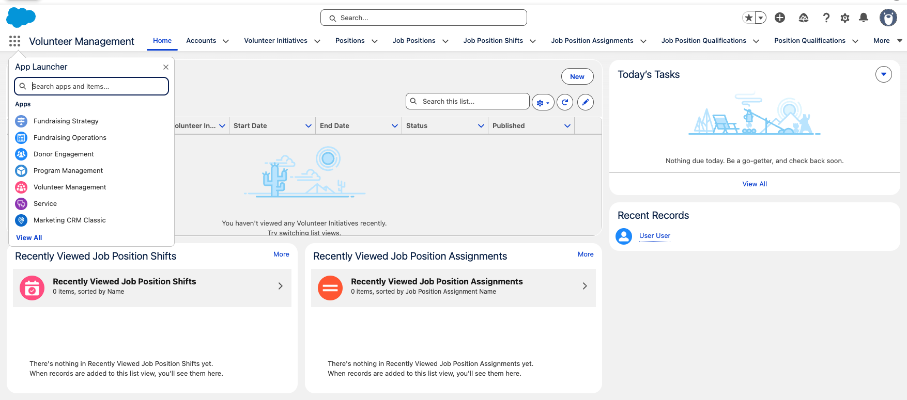

# npc-exploration

The goal of this project is to make it possible to easily explore Nonprofit Cloud features using default configurations and sample datasets, like an NPC trial org but in a throwaway environment. This project is not affiliated with Salesforce and the actual trial experience will differ now and may deviate going forward. This is a work in progress and nothing should be considered complete yet.

## Exploration and Development

To create a scratch org using this configuration:

1. [Set up CumulusCI](https://cumulusci.readthedocs.io/en/latest/tutorial.html)
2. Run `cci org scratch dev explore --default` to deploy this project and assign yourself a whole bunch of permissions.
3. Run `cci flow run dev_org` to deploy this project and assign yourself a whole bunch of permissions.
4. Run `cci org browser` to open the org in your browser.

This will create a scratch org with a number of NPC features enabled, including Fundraising, Program Management, and Volunteer Management. In the future this will also include Grantmaking, but the setup for grantmaking required some additional troubleshooting that hasn't been completed yet.

### Volunteer Management Quick Start

This includes a flow to configure an org using the components from the Volunteer Management Quick Start package provided by Salesforce Solution Engineering. To create an org with the quick start configured, run `cci flow run volunteer_quick_start_org`. You can run this instead of running the `dev_org` flow, or you can run it on an existing scratch org. This includes deployment of metadata that overwrites some standard configuration, so don't deploy it against an existing org unless you know what you're doing.

